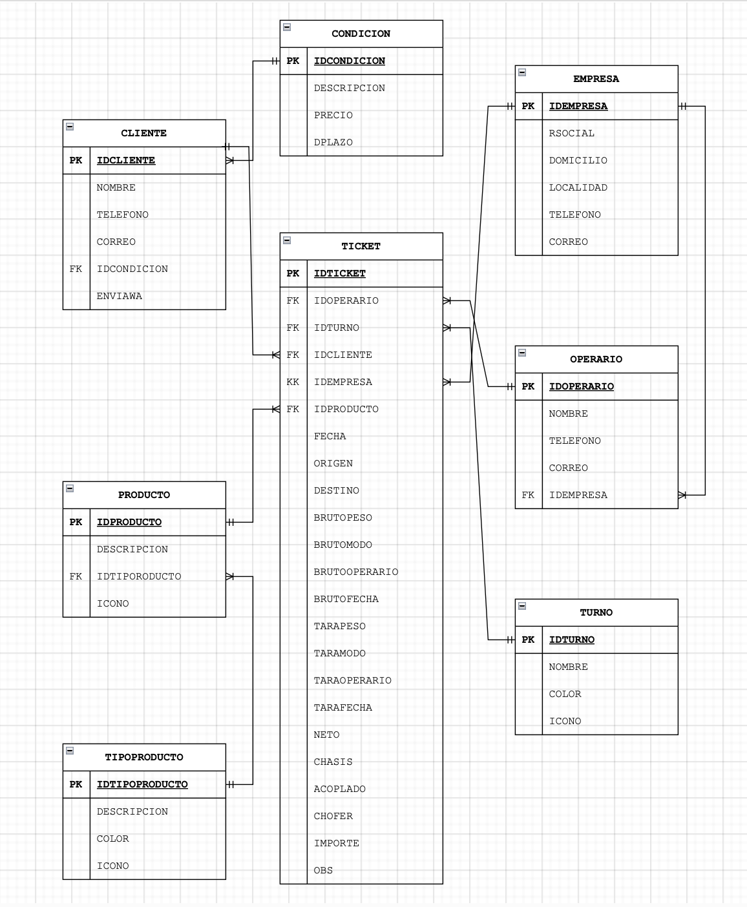

# Soy un titulo

## soy un subtitulo
* [Link a clases de SQL](https://drive.google.com/drive/folders/1qiwny72OGLq4cup8aNJhTcFdCIKRtJ2H?usp=drive_link)

```sql
SELECT
    *
FROM DUAL 
LIMIT 10;

```

---

```bash
echo "params exute data with results" 

```
---

```python
import os

data:str = "jdbc://"

```

```
| -----         |
| TABLE USER    |

```




| nombre | nulidad | tipo dato |
| :----------: |----------| :----------: |
| Row 1    | Cell 2   |  Cell 3|


